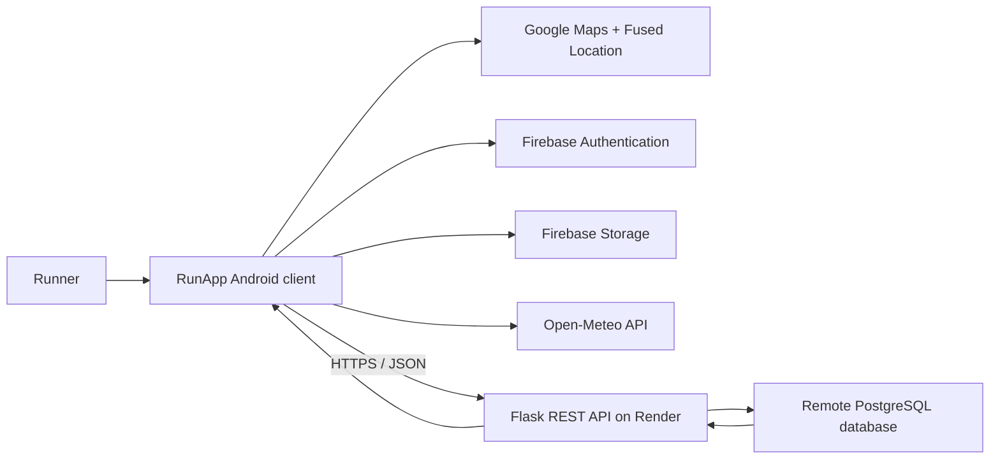

# RunApp

> A full-stack Android running companion that tracks outdoor workouts in real time and synchronizes them with a cloud-hosted REST API.

[](https://developer.android.com/)
[](https://kotlinlang.org/)
[](https://developer.android.com/compose)
[](https://firebase.google.com/)
[](https://flask.palletsprojects.com/)
[](https://render.com/)
[](https://www.postgresql.org/)

RunApp combines native Android development with cloud computing. A runner can create an account, record a GPS-based workout, follow the route on Google Maps, review performance statistics, and access synchronized history from any authenticated session. Run metadata is exchanged through a Python REST API deployed on Render and persisted in a remote PostgreSQL database; generated route images are stored in Firebase Storage.

The Android client is available in this repository. The companion Flask entry point used to implement the REST API is maintained separately as `main.py` in the backend project.

## Project highlights

- Full-stack mobile/cloud architecture rather than device-only storage
- Real-time GPS tracking with route polylines and an animated runner marker
- Secure user sign-up and sign-in through Firebase Authentication
- Cloud persistence of users, runs, profile data, and weekly goals
- Automatic map snapshot generation at the end of a run
- Firebase Storage upload for route images
- Weekly distance, calorie, and duration analytics with an interactive chart
- Hardware sensor integration for shake detection and ambient-light map styling
- Live weather information based on the runner's current position
- Responsive Material 3 interface with light and dark themes

## Features

### Account and profile

- Email/password registration and login with Firebase Authentication
- Firebase display name support
- Personal parameters for weight and height
- Persistent user session and logout flow
- Editable weekly distance and calorie goals

### Live workout tracking

- High-accuracy location updates through the Fused Location Provider
- Start, pause, resume, and stop controls
- Live duration, distance, current speed, and estimated calories
- Google Maps camera tracking and route polyline rendering
- Automatic average-speed calculation when a workout finishes
- Map snapshot capture covering the recorded path
- Current weather and temperature supplied by Open-Meteo

### Activity history and analytics

- Cloud-synchronized activity list
- Detailed workout view with map, duration, distance, calories, and speed
- Sorting by date, distance, duration, calories, or speed
- Ascending and descending sort order
- Remote deletion of saved runs
- Weekly statistics grouped by day
- Previous/next week navigation
- Progress against weekly distance and calorie targets

### Sensors and personalization

- Shake-to-stop prompt using the accelerometer
- Automatic night map style using the ambient light sensor
- App-level dark mode
- Settings stored locally with `SharedPreferences`
- Achievement system for milestones such as first run, 42 km total, speed, calories, night running, and consistency

## System architecture



### Run synchronization flow

1. Firebase Authentication identifies the current user with a unique UID.
2. The Android client records time and successive GPS positions while the run is active.
3. The UI calculates live metrics and renders the route as a Google Maps polyline.
4. When the run ends, the app captures the route as an image.
5. The image is uploaded to Firebase Storage and a download URL is returned.
6. Run metrics and the image URL are sent as JSON to the Flask API.
7. The API writes the run to PostgreSQL and returns an HTTP response.
8. The client reloads the user's history and recalculates dashboard statistics.

## Technology stack

| Layer | Technologies |
| --- | --- |
| Language | Kotlin, Python, SQL |
| Android UI | Jetpack Compose, Material 3 |
| Architecture/state | ViewModel, `StateFlow`, Kotlin coroutines |
| Location and maps | Google Maps Compose, Google Play Services Location |
| Device sensors | Accelerometer, ambient light sensor |
| Authentication | Firebase Authentication |
| Image storage/loading | Firebase Storage, Coil |
| Android networking | `HttpURLConnection`, JSON |
| Backend | Flask, psycopg2 |
| Database | PostgreSQL |
| Cloud hosting | Render |
| Weather | Open-Meteo current weather API |
| Local preferences | Android `SharedPreferences` |
| Offline foundation | Room entity and dependencies are present for future local caching |

## Repository structure

```text
.
├── app/
│   ├── google-services.json          # Firebase Android configuration (supply your own)
│   ├── build.gradle.kts              # Android module and dependencies
│   └── src/main/
│       ├── AndroidManifest.xml       # Permissions, activity, and Maps configuration
│       └── java/com/example/runapp/
│           ├── MainActivity.kt       # Authentication-aware app entry point
│           ├── MainScreen.kt         # Dashboard and screen navigation
│           ├── LoginScreen.kt        # Sign-in/sign-up interface
│           ├── LoginViewModel.kt     # Firebase authentication logic
│           ├── RunSessionScreen.kt   # Live map, run controls, and snapshots
│           ├── RunViewModel.kt       # Tracking, cloud sync, goals, and statistics
│           ├── RunApi.kt             # REST API client
│           ├── RunEntity.kt          # Run data model
│           ├── AllActivitiesScreen.kt
│           ├── RunDetailDialog.kt
│           ├── StatsScreen.kt
│           ├── ProfileScreen.kt
│           ├── SettingsScreen.kt
│           ├── LightSensor.kt
│           └── ShakeDetector.kt
├── gradle/                            # Gradle wrapper and version catalog
├── build.gradle.kts
└── settings.gradle.kts
```

## Requirements

- Android Studio with JDK 11 support
- Android SDK 36 installed
- Android device or emulator running Android 8.0 / API 26 or newer
- A Google Maps Platform API key with **Maps SDK for Android** enabled
- A Firebase project with:
  - an Android app registered for `com.example.runapp`
  - Email/Password Authentication enabled
  - Firebase Storage enabled
- Access to a running instance of the Flask API
- PostgreSQL for a self-hosted backend
- Python 3.10+ for local backend development

A physical Android device is recommended because GPS, accelerometer, light-sensor, and camera/map behavior are more representative than on an emulator.

## Android setup

1. Clone the repository:

   ```bash
   git clone git@github.com:mattia9203/Mobile-Application-and-Cloud-Computing.git
   cd Mobile-Application-and-Cloud-Computing
   ```

2. Open the root directory in Android Studio and allow Gradle to synchronize.

3. Register an Android app in Firebase using the package name `com.example.runapp`. Download its `google-services.json` and place it at:

   ```text
   app/google-services.json
   ```

4. In the Firebase console, enable **Authentication → Sign-in method → Email/Password** and configure Firebase Storage rules appropriate for authenticated users.

5. Create or select a Google Cloud project, enable **Maps SDK for Android**, and configure an Android-restricted API key for this package and its signing certificate.

6. Configure the Maps key in `app/src/main/AndroidManifest.xml`. For a public repository, use a Gradle manifest placeholder or a local, untracked secrets file rather than committing the key directly.

7. Set the backend base URL in `RunApi.kt`:

   ```kotlin
   private const val BASE_URL = "https://your-service.onrender.com"
   ```

   The current client is configured for the deployed RunApp Render service.

8. Build and install the debug version:

   ```bash
   ./gradlew assembleDebug
   ./gradlew installDebug
   ```

9. Launch the app, create an account, approve the requested location permission, and start a run.

## Backend setup

The supplied backend is a small Flask service using `psycopg2` to communicate with PostgreSQL.

### 1. Create an environment

```bash
python3 -m venv .venv
source .venv/bin/activate
pip install Flask psycopg2-binary gunicorn
```

Create a `requirements.txt` for deployment:

```text
Flask
gunicorn
psycopg2-binary
```

### 2. Configure the database safely

Database credentials must be supplied through environment variables. A production-ready configuration can use individual values or a single `DATABASE_URL` provided by the hosting platform:

```bash
export DB_HOST="your-database-host"
export DB_NAME="your-database-name"
export DB_USER="your-database-user"
export DB_PASSWORD="your-database-password"
```

Then read those values in `main.py` with `os.environ`. Do not commit passwords or production connection strings.

### 3. Create the core tables

The following is a minimal schema compatible with the attached core API. Adapt data types and constraints to your production requirements:

```sql
CREATE TABLE users (
    user_id VARCHAR(128) PRIMARY KEY,
    name VARCHAR(120),
    weight NUMERIC(6, 2),
    height NUMERIC(6, 2)
);

CREATE TABLE runs (
    run_id SERIAL PRIMARY KEY,
    user_id VARCHAR(128) NOT NULL REFERENCES users(user_id) ON DELETE CASCADE,
    timestamp BIGINT NOT NULL,
    duration BIGINT NOT NULL,
    distance_km DOUBLE PRECISION NOT NULL,
    calories INTEGER NOT NULL,
    avg_speed DOUBLE PRECISION NOT NULL,
    path_points TEXT,
    image_url TEXT,
    created_at TIMESTAMPTZ NOT NULL DEFAULT NOW()
);

CREATE INDEX idx_runs_user_timestamp
    ON runs (user_id, timestamp DESC);
```

The Android client also calls profile and weekly-goal endpoints. Keep the deployed backend synchronized with `RunApi.kt` if those extensions are enabled.

### 4. Run locally

```bash
flask --app main run --debug --host 0.0.0.0 --port 5000
```

Check the health endpoint:

```bash
curl http://localhost:5000/
```

### 5. Deploy on Render

Create a Render Web Service connected to the backend repository and use:

- Build command: `pip install -r requirements.txt`
- Start command: `gunicorn main:app`
- Environment: add the database variables as secrets
- Health check path: `/`

After deployment, update `BASE_URL` in the Android client to the HTTPS service URL.

## REST API

All request and response bodies use JSON. User-owned resources are associated with the Firebase UID sent by the client.

### Core endpoints in the attached Flask service

| Method | Endpoint | Purpose | Success response |
| --- | --- | --- | --- |
| `GET` | `/` | Service health check | `200 OK` |
| `POST` | `/create_user` | Insert a user if the UID does not exist | `201 Created` |
| `POST` | `/create_run` | Persist a completed run | `201 Created` |
| `GET` | `/get_runs?uid={uid}` | Return a user's runs, newest first | `200 OK` |
| `DELETE` | `/delete_run?run_id={id}` | Delete a run by its database ID | `200 OK` |

### Client extension endpoints

`RunApi.kt` also integrates with these endpoints in the deployed service:

| Method | Endpoint | Purpose |
| --- | --- | --- |
| `GET` | `/get_user?uid={uid}` | Load profile data |
| `POST` | `/set_weekly_goal` | Create or update weekly targets |
| `GET` | `/get_weekly_goal?uid={uid}&week_start_date={yyyy-MM-dd}` | Load targets for a week |

### Example: create a user

```bash
curl -X POST https://your-service.onrender.com/create_user \
  -H "Content-Type: application/json" \
  -d '{
    "uid": "firebase-user-id",
    "name": "Demo Runner",
    "weight": "70",
    "height": "175"
  }'
```

### Example: save a run

```bash
curl -X POST https://your-service.onrender.com/create_run \
  -H "Content-Type: application/json" \
  -d '{
    "uid": "firebase-user-id",
    "timestamp": 1767225600000,
    "duration": 1800000,
    "distance": 5.2,
    "calories": 364,
    "speed": 10.4,
    "path_points": [],
    "image_url": "https://example.com/run-map.jpg"
  }'
```

### Example run response

```json
[
  {
    "id": 42,
    "timestamp": 1767225600000,
    "duration": 1800000,
    "distance": 5.2,
    "calories": 364,
    "speed": 10.4,
    "image_url": "https://example.com/run-map.jpg"
  }
]
```

## Android permissions

| Permission | Why it is needed |
| --- | --- |
| Internet / network state | REST API, Firebase, Maps, image loading, and weather |
| Fine and coarse location | Live GPS workout tracking |
| Activity recognition | Physical-activity-aware features |
| Camera / camera hardware | Included for CameraX-based media capabilities |

Permissions should be requested at runtime only when the related feature is used, with a clear explanation to the user.

## Security and production hardening

This project is suitable as a portfolio and learning project. Before publishing or deploying it as a production application:

- Rotate any API keys or database passwords that have ever been committed or shared.
- Keep PostgreSQL credentials exclusively in Render environment variables.
- Restrict the Google Maps key by Android package name and SHA certificate fingerprint.
- Apply Firebase Storage rules so users can only access allowed paths.
- Verify Firebase ID tokens on the Flask server instead of trusting a UID supplied in JSON or query parameters.
- Authorize deletion by both `run_id` and authenticated user identity.
- Add payload validation, consistent error responses, request timeouts, and rate limiting.
- Use a PostgreSQL connection pool and guarantee cleanup with context managers or `finally` blocks.
- Disable Flask debug mode outside local development.
- Use HTTPS for every production endpoint and remove cleartext-traffic support when no longer required.
- Add a privacy policy explaining location, profile, and workout-data processing.

## Testing

Run the existing Android test tasks with:

```bash
./gradlew test
./gradlew connectedAndroidTest
```

Recommended next tests include:

- ViewModel tests for timer, weekly aggregation, sorting, and goal calculations
- API serialization and error-path tests using a mock web server
- Compose UI tests for authentication, run controls, and history
- Flask endpoint tests with a temporary test database
- End-to-end tests covering authentication, upload, database persistence, and deletion

## Future improvements

- Complete Room-based offline caching and background synchronization
- Move the REST client behind repository interfaces and dependency injection
- Replace manual JSON/network handling with a typed API layer
- Store the complete GPS path in PostgreSQL as JSON/JSONB or geospatial data
- Verify Firebase tokens server-side and enforce per-user authorization
- Add background/foreground service tracking for long runs
- Export runs to GPX or shareable images
- Add pace splits, elevation, personal records, and longer-term trends
- Add continuous integration for linting, tests, and release builds
- Publish screenshots or a short demo video for the portfolio presentation

## What this project demonstrates

RunApp demonstrates practical experience across mobile and cloud development: declarative Android UI, lifecycle-aware state, coroutines, GPS and sensor APIs, third-party services, authentication, object storage, REST design, Python backend development, relational data modeling, and cloud deployment.

Developed by [@mattia9203](https://github.com/mattia9203).
